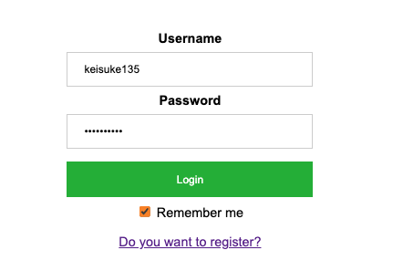

# fakebook (Mini facebook clone app)
As a Node.js Tutorial, I created facebook clone appication.  

## Built with
- Node.js
- Express
- MySQL

## Main Features  
- Login / SignUp 
- Showing Posts
- Posting texts
- Showing Follower/Following
- Searching User
- Showing User's all the posts

## Screen Shots
### Login
  
***
### Sign Up
  
***
### Home
  
***
### Posting
  
***
### Follower/Following
  
***
### My Page
  

## Missing Features  
- [x] CSRF Module
- [ ] SQL Injection
- [ ] Brute Force Prevention
- [ ] etc .. 