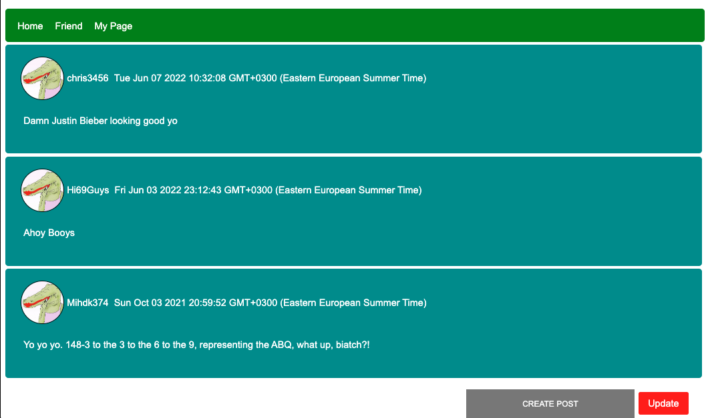

# fakebook (Mini Facebook Clone App)
I developed a Facebook clone app as part of my Node.js tutorial.

## Usage
Run the command below
```
node bin/var
```

## Built with
- Node.js
- Express
- MySQL

## Main Features  
- Login / SignUp 
- Showing Posts
- Posting texts
- Showing Follower/Following
- Searching User
- Showing User's all the posts

## Screen Shots
### Login
  
***
### Sign Up
  
***
### Home
  
***
### Posting
  
***
### Follower/Following
  
***
### My Page
  


## Missing Features  
- [x] CSRF Module
- [ ] SQL Injection Prevention
- [ ] Brute Force Prevention
- [ ] Image Uploading Feature
- [ ] etc .. 
